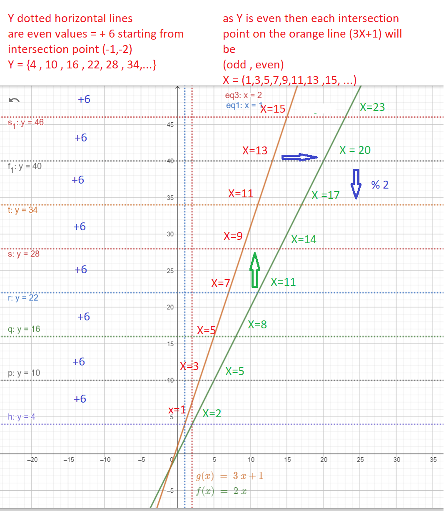
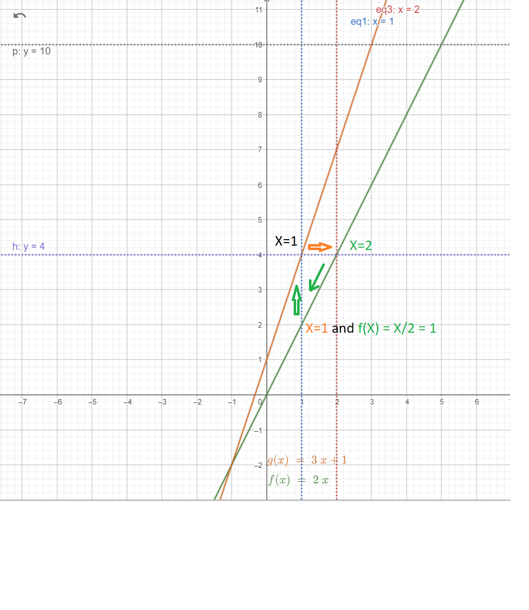
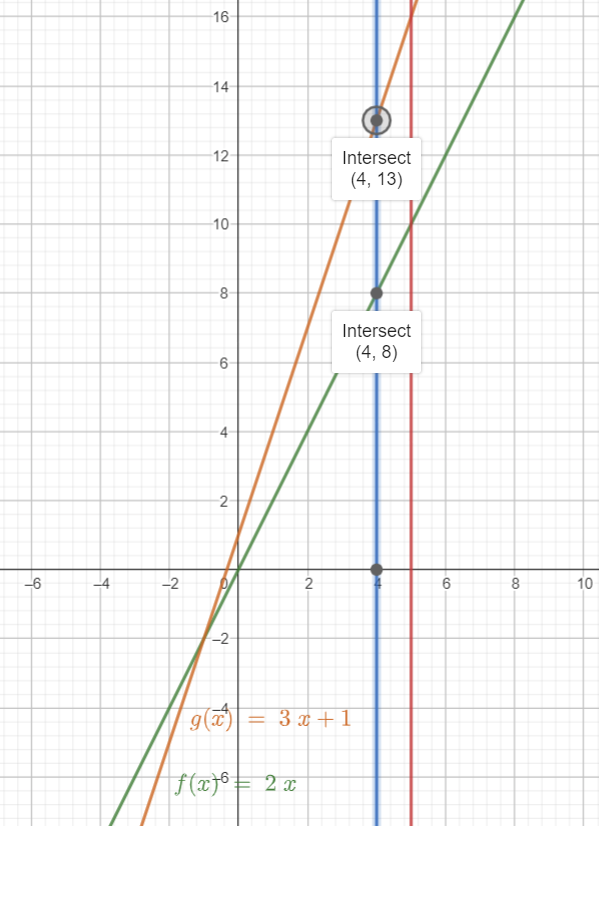
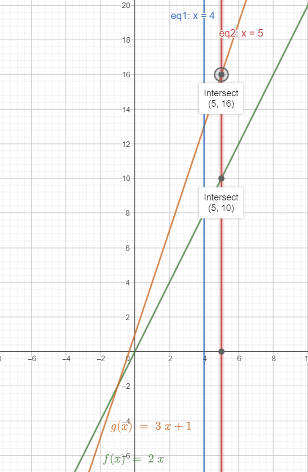

# Collatz Conjecture  ( 3 * N + 1 )
Collatz 4-2-1 Cycle (State Diagram)
using some analysis on natural numbers I was able to construct some correlation between the numbers. Based on this correlation I was able to classify the natural numbers into 10 classes. 
Then create a state diagram that shows one Cycle (4-2-1) for any sequence of Collatz operations. 
•	If the number is even, divide it by two.
•	If the number is odd, triple it and add one.

each state has 2 [IN] arrows and 2 [OUT] arrows. Except two classes even numbers end with digit 6 and even numbers end with digit 2.
The state [Even number end with digit 2] force flow every time to one direction to state [ odd number end with digit 3] 
Therefor state flow ends at state [ Even number end with digit 2] and goes in one direction only and this keeps repeating in the flow until it reaches state [even umber ends with 4] at X = 4 then the flow will be in cycle [4-2-1] and will never get out of this cycle.
The main flow in this state diagram is the flow that switch from odd numbers into even numbers which is from state [odd number ends with digit 3] to state [even number ends with digit 0] 

also I show the visualization for the Collatz sequence of operations as linear functions g(x) = 3 * X + 1 and f(x) = 2 X and its effect on the final number result.
I used f(x) as 2X to force even numebrs and flip from even to odd. both functions will have the same value y = 4 for g(1) and f(2).
so we end up with one triangle between the two linea functions g(x) and f(x) at 4 , 2 , 1. 

